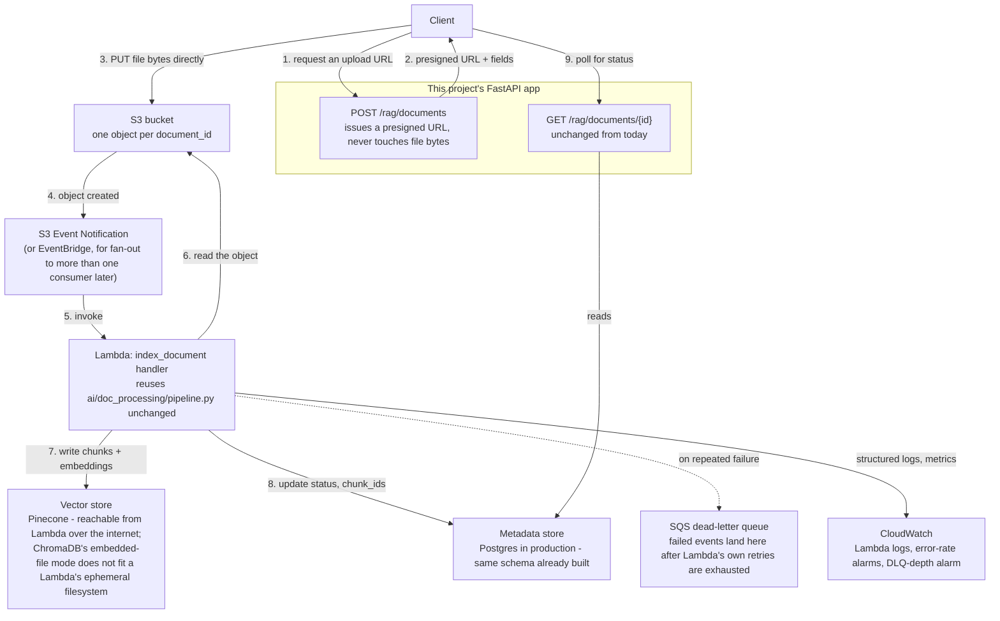

# S3 + Lambda async upload — design for a future phase

**Status: design only, not implemented.** This is what "upload → index" would
look like built the way a production system handles it, for a later phase -
see `docs/RAG-ROADMAP.md` for what's actually built today (synchronous,
local disk, a FastAPI route calling the pipeline directly).

## Why this design exists

Today's `POST /rag/documents` writes the file to local disk through the API
process itself, and a separate `POST /rag/documents/{id}/index` call runs
chunking/embedding/indexing synchronously, inside the same request/response
cycle. That's the right choice for this project's current scale (a handful
of PDFs, one developer testing locally) and the wrong choice at real scale,
for three concrete reasons:

1. **Large files shouldn't pass through the API server.** A multipart
   upload sits in the FastAPI process's memory/disk for the whole request -
   fine for a few MB, a real liability at scale (memory pressure, slow
   uploads holding a worker thread, API Gateway's own payload size limits
   if this ever sits behind one).
2. **Indexing shouldn't block the HTTP response.** Chunking + embedding +
   indexing a large document can take longer than a client (or a load
   balancer, or API Gateway) is willing to wait on one request - today's
   design already accepts this for local testing, but it doesn't survive a
   real multi-page policy document or a batch of them.
3. **Retrying a failed index shouldn't mean re-uploading.** This project
   already solved half of this by decoupling upload from indexing (see
   `RAG-ROADMAP.md` Phase 2/3) - this design is that same principle, taken
   the rest of the way: indexing becomes event-driven and independently
   retryable, not tied to any one HTTP request's lifetime at all.

## The flow

```mermaid
sequenceDiagram
    actor Client
    participant API as FastAPI (POST /rag/documents)
    participant S3 as S3 bucket
    participant Lambda as Lambda (index_document handler)
    participant Meta as Metadata store
    participant Vec as Vector store
    participant DLQ as Dead-letter queue

    Client->>API: POST /rag/documents (filename, content_type)
    API->>Meta: create_document(id, filename, status="pending_upload")
    API->>S3: generate a presigned POST URL for this document's key
    API-->>Client: {document_id, upload_url, upload_fields}

    Client->>S3: PUT the file bytes directly, using the presigned URL
    Note over Client,S3: The API process never sees the file's bytes -<br/>this is the part that removes the size/memory problem.

    S3->>Lambda: ObjectCreated event (bucket, key)
    activate Lambda
    Lambda->>Meta: update_status(id, "indexing")
    Lambda->>Lambda: chunk_document() / embed_chunks() / index_chunks()<br/>(the SAME pipeline.py code that runs synchronously today)
    Lambda->>Vec: upsert chunks + embeddings
    Lambda->>Meta: set_chunk_ids(id, new_ids); update_status(id, "indexed")
    deactivate Lambda

    alt processing fails after retries
        Lambda->>DLQ: failed event, for inspection/replay
        Lambda->>Meta: update_status(id, "failed", error_message)
    end

    Client->>API: GET /rag/documents/{id}  (poll, or a future webhook/websocket)
    API-->>Client: {status: "indexed", chunk_ids: [...]}
```

## Components



## Design decisions worth stating explicitly

**Presigned POST, not a Lambda in front of the upload.** The client uploads
straight to S3 using short-lived, scoped credentials the API hands out -
the API's own request/response cycle is done in milliseconds (just a
metadata-store write and a presigned-URL call), regardless of file size.

**S3 event triggers Lambda directly for one consumer; EventBridge if there's
ever a second one.** A plain S3 → Lambda event notification is simpler and
is enough for this design. If a future phase needs more than one thing to
react to a new upload (say, a separate virus-scan step, or an audit-log
consumer), that's the point to introduce EventBridge as a fan-out layer
rather than chaining S3 notifications directly to multiple Lambdas.

**The Lambda handler is a thin adapter over code that already exists.**
`chunk_document()`, `embed_chunks()`, `index_chunks()` in
`ai/doc_processing/pipeline.py` don't change - the Lambda handler's whole
job is: read the S3 event, download the object (or stream it), call
`pipeline.index_document()`, done. This is exactly why that pipeline was
built as plain functions rather than something that only makes sense
wired to a FastAPI request - it was already shaped to be called from
somewhere else.

**ChromaDB's embedded/persistent mode does not fit here.** A Lambda's
filesystem is ephemeral and not shared across invocations - the
`data/chroma_db/` directory this project relies on locally doesn't survive
between Lambda calls, and can't be shared across concurrent ones either.
Pinecone (already built and tested - see `RAG-ROADMAP.md` Phase 2.6) is the
natural fit for this design specifically because it's a real external
service reachable over the network, not a local file. ChromaDB would need
its `http` mode against a separately-run, persistent Chroma server to work
here at all - an extra piece of infrastructure this design doesn't assume.

**Failure handling: retry, then dead-letter, then alarm.** Lambda's own
built-in retry (on invocation failure) handles transient errors (a brief
OpenAI rate limit, say). Exhausted retries land the event in an SQS DLQ,
not silently dropped - and a CloudWatch alarm on DLQ depth is what tells a
human to look, rather than a document silently staying "pending" forever.

**Status is polled today, pushed later.** `GET /rag/documents/{id}` already
exists and already reports status - a client polling it needs no new API.
A webhook or WebSocket push notification on completion is a reasonable
enhancement, not a requirement to make this design work.

## What would actually need building, when this phase is picked up

- An upload endpoint that returns a presigned URL instead of accepting
  `UploadFile` directly (a real API contract change, not additive - this
  would replace, not sit beside, today's `POST /rag/documents`).
- The Lambda handler itself (a new, small file - the pipeline it calls
  already exists).
- IaC for the bucket, event notification, Lambda, IAM role, DLQ, and
  CloudWatch alarms - see the "provisioning" question this document's
  sibling answer covers: AWS CDK (Python) is the recommended tool, for the
  reasons given there.
- A decision on the metadata store in this topology - SQLite's a single
  local file, which a Lambda can't share across invocations either;
  Postgres (already built and tested - `RAG-ROADMAP.md` Phase 2.5) is the
  one that actually works here, the same reasoning as the ChromaDB point
  above.
