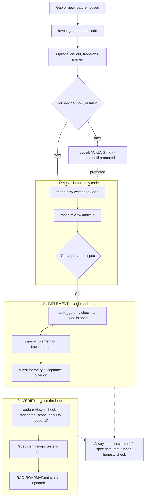

# Spec Sheet — Spec-Driven Development for hrb_chatbot_v2

*rev. 2026-09-15 — written for a Python/FastAPI beginner coming from a Java/Spring background.*

How this project decides what gets built, in what order, and how a gap in already-shipped code gets fixed without guessing. Written after Phase 16 (content-hash duplicate-upload detection) became the first change to go through the process end to end.

## §1 — The idea in one sentence

A **skill** is guidance the agent can choose to follow — like a runbook a teammate reads before starting. A **hook** runs on a fixed path the agent doesn't control — like a pre-commit check nobody can argue their way past. Neither alone stops drift; together, a spec gets written and reviewed *before* code, and the hooks make sure that order actually holds.

## §2 — The lifecycle

Same path whether it's a brand-new feature or, like Phase 16, a gap in code that already shipped.

*Not approved → back to `/spec-new`, not forward to code.*

**Why it's blocking:** Stage 2's first step, `spec_gate.py`, is a `PreToolUse` hook — it physically refuses to let the agent write to `src/hrb_chatbot/**` if no phase in the roadmap has an open, written spec. It only checks that *a* spec exists, not that this exact edit matches it — staying in scope is a rule the implementer follows, not something the hook can verify.

**If the gate blocks a write you expected to work:** the fix is almost
always `/spec-new` on the relevant phase first, not disabling the hook.
The gate only watches `src/hrb_chatbot/**` — edits under `.claude/`,
`docs/`, or `tests/` are never blocked, specifically so a bug in the gate
itself is always fixable.

## §3 — The three stages, plainly

| Stage | What happens | Lives in |
|---|---|---|
| **01 · SPEC** — write down what, before how | Context, the exact request/response contract, what counts as done, what's deliberately left out. No code yet — this is reviewed on its own. | `docs/RAG-ROADMAP.md` |
| **02 · IMPLEMENT** — build to the spec, not around it | A test for every acceptance criterion the spec named. The gate hook won't allow a source edit until the spec exists. | `src/hrb_chatbot/`, `tests/` |
| **03 · VERIFY** — prove it, then close it | Optionally, `code-reviewer` flags standards/scope/security issues first (flags only, fixes go back through IMPLEMENT). Then map tests back to the spec's own criteria, run the full suite, flip the phase's checkbox, and record what was actually checked. | `docs/RAG-ROADMAP.md` |

## §4 — Where everything lives

No separate `specs/` or `adr/` folder — this project already had the equivalent, so SDD was grafted onto it instead of duplicating it.

| Path | Kind | What it's for |
|---|---|---|
| `CLAUDE.md` | rulebook | The project's constitution. Its SDD section is the summary of everything on this page. |
| `docs/RAG-ROADMAP.md` | specs live here | Both the plan and the history. Every phase is a bullet; a spec is a `Spec:` block written into that bullet before its code. |
| `docs/BACKLOG.md` | intake | Where a planned fix or feature starts, before it's promoted into a roadmap phase with its own spec. |
| `docs/FAQ.md` | decisions | This project's ADR-equivalent — why a design choice was made, referenced by `/architecture-review`. |
| `docs/CODING-STANDARDS.md` | house style | The rules `/coding-standards` enforces on every new or changed file. |
| `.claude/skills/*/SKILL.md` | guidance | Eight slash commands: session-start, delivery-note, spec-new, spec-review, spec-verify, spec-implement, coding-standards, architecture-review. |
| `.claude/agents/implementer.md` | subagent | Runs one already-approved spec end to end in its own scoped context. |
| `.claude/agents/code-reviewer.md` | subagent | Read-only: flags standards/scope/security issues on a phase's diff. Never edits, never fixes. |
| `.claude/settings.json` | enforcement | Wires four hooks: `SessionStart` (session brief, automatic), `PreToolUse` (the spec gate — blocking), `PostToolUse` (the test runner — automatic), `Stop` (the honesty check — can deny ending the turn on an unverified "done" claim, not merely advisory). |
| `.claude/scripts/*.py` | enforcement | The actual logic each hook runs — plain Python, testable on its own by piping in a payload. |
| `src/hrb_chatbot/` | gated | Where code lands — the one path the spec gate actually watches. |

## §5 — Worked example: Phase 16

**Roadmap phase 16 — Content-hash duplicate-upload detection, reinstated**

| Step | What happened |
|---|---|
| Found | Uploading the same PDF twice created two documents instead of one, reported live via Postman. |
| Investigated | The check, `find_by_content_hash()`, was already fully implemented — just never called since an earlier, deliberate, "revisit later" removal. |
| Spec'd | `/spec-new` wrote context, contract, and one explicitly inherited edge case into the Phase 16 bullet — before any code changed. |
| Approved | Reviewed against three options; the smallest, already-tested one was chosen. |
| Built | One call restored, two tests brought back, one comment updated. Nothing else touched. |
| Verified | 89/89 tests green; the exact reported scenario re-run live and confirmed fixed. |

## §6 — Which skill or agent, when

| You want to... | Reach for |
|---|---|
| Start a session and see what's open | `/session-start` (also runs automatically) |
| Turn a backlog item into a spec'd phase | `/spec-new` |
| Sanity-check a spec before any code is written | `/spec-review` |
| Build a spec'd phase yourself, in the main session | `/spec-implement` |
| Hand a spec'd phase to a scoped subagent instead | `implementer` (Agent tool) |
| Flag standards/scope/security issues on a diff, without fixing them | `code-reviewer` (Agent tool) |
| Confirm tests actually cover the spec's acceptance criteria | `/spec-verify` |
| Get a short, honest end-of-task summary | `/delivery-note` (also runs automatically) |
| Check a design against settled decisions in `CLAUDE.md`/`docs/FAQ.md` | `/architecture-review` |
| Recall or enforce house style while writing code | `/coding-standards` |

`implementer` and `code-reviewer` are separate for a reason: one writes
code inside a phase's declared scope, the other only reads and flags. A
single subagent doing both would be reviewing its own work.

## §7 — Terms, translated

For a Spring/Java background — the nearest familiar shape, not an exact match.

| Term | Like... | Actually |
|---|---|---|
| **Spec** | a design doc reviewed before a PR | Not a Jira ticket — a written contract (request/response shape, failure modes, what's out of scope) that exists *before* the diff, not summarized from it after. |
| **Skill** | a team runbook, not a script | Instructions the agent reads and follows — it can still be skipped or rushed, same as a human skimming a runbook under deadline pressure. |
| **Hook** | a git pre-commit hook, for the agent | Runs on a fixed lifecycle event outside the model's own reasoning. `PreToolUse` fires before a file write; `PostToolUse` after; `Stop` before the turn is allowed to end. |
| **Subagent** | a scoped ticket handed to a junior dev | A separate context window given one already-approved spec and a tight brief — works it end to end, reports back, doesn't wander into unrelated files. `code-reviewer` is the same idea with no write access at all — a second reviewer, not a second implementer. |
| **Gate hook** | a required status check on a PR | `spec_gate.py` — refuses the write outright, not just a warning, if no phase has an open spec. Scoped to `src/hrb_chatbot/` only, so it can never block fixing the tooling itself. |

---
*hrb_chatbot_v2 · adapted from Joshua McDonald's SDD pattern · see `CLAUDE.md` → "Spec-Driven Development (SDD)"*
