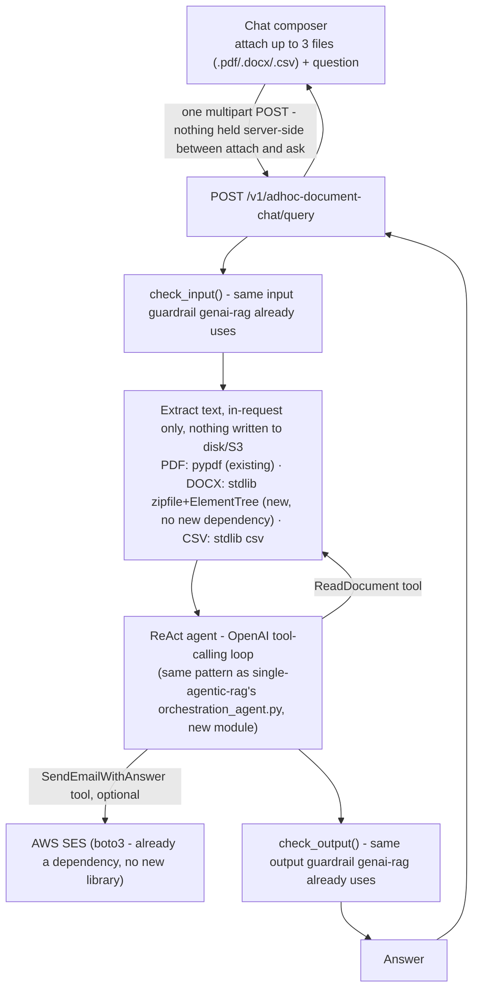

# Chat GenAI Workflow

Design doc for a new, user-requested capability: ad-hoc document Q&A
directly from the Chat UI, deliberately **separate** from this project's
main RAG pipeline (no S3, no vector store, no persisted metadata). Written
before implementation, per explicit instruction. Decisions marked
**(autonomous call)** were made without stopping for approval, per the
user's own explicit "don't wait for my approvals" instruction on this task -
each is flagged so it's easy to revisit.

## What this is, in one paragraph

A user attaches up to 3 files (PDF/Word/CSV) directly in the chat composer
and asks a question. A ReAct agent reads the attached files (and only the
attached files - no KB, no MCP, no web search) and answers. Nothing about
the files is stored: no S3 object, no document row, no vector write, no
chunk metadata in any log. The pipeline dropdown keeps showing "GenAI RAG" -
this is a variant of that same user-facing mode, not a new option to
choose. The answer can optionally be emailed to someone.

## Why a separate architecture, not a reuse of the existing pipeline

The existing `ai/rag_pipeline/pipeline.py` is built entirely around a
persistent, pre-indexed knowledge base: retrieval assumes a vector store
exists, chunks are looked up by `document_id`, Explainability assumes
`vector_db`/`search_strategy`/citations. None of that exists here - there
is no index to retrieve from, no `document_id`, nothing to cite back to a
stored chunk. Threading this use case through the existing pipeline would
mean a growing pile of `if adhoc:` branches through code whose whole shape
assumes persistence. A separate, small, parallel path is simpler to read,
simpler to reason about, and can't accidentally regress the real RAG path.

## Architecture



Nothing in this path touches `common/clients/db_client/**`,
`ai/doc_processing/indexing/**`, or any metadata-store write - deliberately,
per the requirement.

## Decisions

### 1. One request, not attach-then-ask

Files and the question are submitted together, in one multipart POST. No
server-side temporary storage of any kind between "user attaches a file"
and "user asks a question" - there is no gap for anything to need cleaning
up, expiring, or leaking. **(autonomous call, low-risk)** - the simplest
shape that satisfies "don't reuse the S3/indexing architecture."

### 2. Text extraction - zero new runtime dependencies

- **PDF**: reuses `ai/doc_processing/chunking/text_chunker.py`'s existing
  `extract_text_from_pdf()` unchanged.
- **CSV**: Python's stdlib `csv` module - no new dependency.
- **DOCX**: **(autonomous call)** a `.docx` file is a zip archive of XML
  parts - `zipfile` + `xml.etree.ElementTree` (both stdlib) can pull the
  paragraph text out of `word/document.xml` directly, without the
  `python-docx` library. This project's own standing rule is that a new
  library needs explicit sign-off before it's added - rather than block
  implementation on that approval while the user is away, this avoids the
  question entirely. Tradeoff, stated plainly: this is cruder than
  `python-docx` - it gets paragraph text, not tables, headers/footers, or
  formatting. Good enough for "answer a question about this document's
  content," not a general-purpose Word parser. If that turns out to be too
  limited in practice, `python-docx` is the natural upgrade - a real
  library-approval conversation for a later turn, not guessed around here.

### 3. ReAct agent, two tools, LLM calls only

New `ai/agents/workflow_agents/adhoc_document_agent.py`, same
`GatewayChatModel`/OpenAI-tool-calling pattern `orchestration_agent.py`
(single-agentic-rag) already uses - not shared code, since this module's
job is deliberately smaller (no `SearchKnowledgeBase`/MCP tools exist
here at all).

- `ReadDocument(filename: str) -> str` - returns that one attached file's
  extracted text. The agent decides which attached file(s) are relevant to
  the question, same "the tool call is the retrieval step" idea as a real
  ReAct agent, just over 3 in-memory files instead of a vector store.
- `SendEmailWithAnswer(recipient_email: str) -> str` - only called if the
  user actually asked for the answer to be emailed; confirms success/failure
  back to the agent so it can tell the user plainly.

**No vector DB, no MCP, no web search tool exists in this agent's tool
list at all** - architecturally enforced (the tool isn't registered, not
just "the agent is told not to use it").

### 4. Guardrails - reused, not rebuilt

`check_input()`/`check_output()` (the same NeMo-Guardrails-backed checks
`ai/rag_core/guarded_pipeline.py` already wires into genai-rag) wrap this
flow too. **(autonomous call)** - this directly answers the earlier,
separately-raised "content-safety guardrails for uploads" ask: file content
still reaches the LLM here even though nothing is persisted, so the same
real concern applies, and reusing the existing guardrail is both correct
and zero new design surface.

### 5. Who can use it

**(autonomous call)** open to all three roles (employee/manager/hr_support) -
unlike the Upload/Documents pages (HR_SUPPORT-only, because those manage
the shared KB), this is a personal, ephemeral scratch tool that doesn't
touch shared state, so there's no reason to restrict it the same way.

### 6. Context-window budget

**(autonomous call)** combined extracted text across all attached files is
capped (target: ~12,000 characters per file, ~36,000 total) - if a file's
extracted text is longer, it's truncated with a clear marker
(`...[truncated, N characters omitted]`) rather than silently cut or
blowing the model's context window. The user sees a warning when this
happens, not a silently incomplete answer.

### 7. Multi-turn conversations

**(autonomous call)** stateless to start - a follow-up question re-sends
the same attached files (the frontend keeps them in memory for the
conversation's lifetime, not the server). A real limitation if someone
expects to attach once and ask many questions across a page reload -
flagged, not solved here.

### 8. Pipeline dropdown

Stays on "GenAI RAG" - no new dropdown entry. Attaching a file is what
switches the backend call from `askQuery()` to the new ad-hoc endpoint;
the label the user sees doesn't change. **(user's own explicit
instruction, not an autonomous call.)**

### 9. Explainability

The existing Explainability modal assumes a `RagQueryResponse`-shaped
message (vector_db, search_strategy, citations, LLM Context's chunk
attribution) - none of that applies here. **(autonomous call)** a much
smaller, separate explainability view for an ad-hoc answer: which attached
file(s) `ReadDocument` actually pulled from, the question, the system
prompt, the answer, latency/tokens. No Knowledge Sources/Citations/KB
Retrieved Inputs sections - there is no KB.

### 10. Email delivery

**AWS SES** via `boto3.client("ses")` - already a dependency, no new
library needed, same AWS account already used for S3/Lambda/App Runner.
New `common/clients/email_client/ses_client.py`, matching the plain-
function convention `s3_upload_client.py` already established (one
provider, nothing to swap at runtime, no `Base*Client`/Gateway pair
needed). **Requires one real one-time AWS step this session can't do
unattended: SES starts every new account in sandbox mode, where it can
only send to pre-verified email addresses** - the user's own sending
identity (or domain) needs verifying in the SES console before a real
email can go out to an arbitrary recipient. Flagged as a real deployment
step, not assumed already done.

## New endpoint contract

`POST /v1/adhoc-document-chat/query` - multipart form:

```
user_profile: {"employee_id": "...", "full_name": "...", "role": "..."}  (JSON string field)
question: "..."                                                          (plain field)
recipient_email: "..."                                                   (optional plain field)
files: up to 3 files, .pdf/.docx/.csv, 10MB each                         (file fields)
```

Response:

```json
{
  "question": "...",
  "answer": "...",
  "files_used": ["policy-draft.docx"],
  "email_sent_to": null,
  "model_used": "gpt-4.1-mini",
  "latency_ms": { "total": 0 },
  "token_usage": { "prompt_tokens": 0, "completion_tokens": 0, "total_tokens": 0 }
}
```

## Explicitly out of scope this phase

- Persisting ad-hoc conversations across a page reload.
- A general-purpose Word parser (tables, headers/footers) - stdlib
  paragraph-text extraction only, see Decision 2.
- Any file type beyond PDF/DOCX/CSV.
- Rate limiting beyond reusing the existing `enforce_rate_limit()` as-is
  (no new, stricter limit specific to this endpoint, even though it's
  synchronous LLM-call-per-request and could be more costly per call than
  a cached genai-rag answer).

## Open questions carried into implementation

None blocking - every decision above either has a clear default or is
explicitly flagged as a known limitation. The one real external dependency
(SES sandbox verification) is an AWS-console step, not a code decision.
