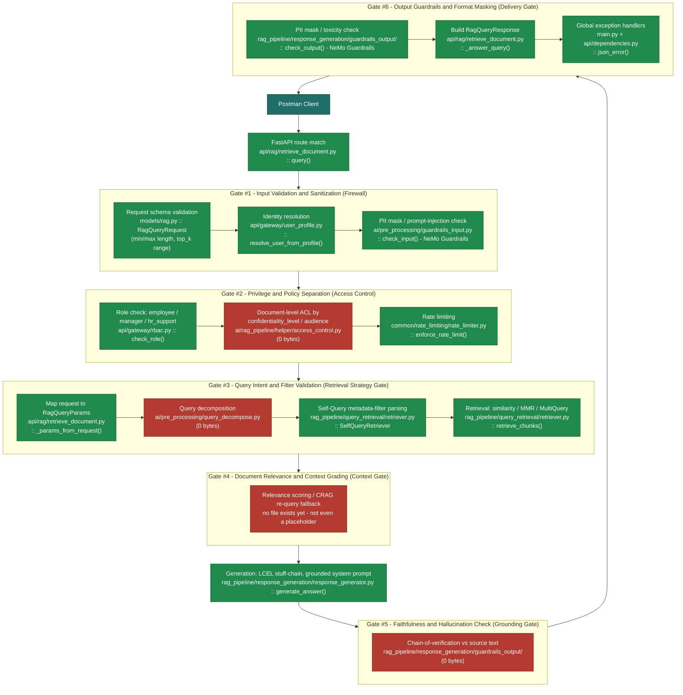

# RAG Pipeline Status

Snapshot: 2026-09-21. Two things this file tracks together, since they were
reviewed together:

1. **IK FDE cohort Modules 4/5/6** (RAG pipeline, evaluation, agentic RAG) -
   what's built here against the workshop's own samples.
2. **The full request lifecycle** for `POST /v1/genai-rag/retrieve-document/query`
   ("the rag-search endpoint"), traced stage by stage, overlaid with the
   **six-layer validation gateway** framework (Input Firewall -> Access
   Control -> Retrieval Strategy Gate -> Context Gate -> Grounding Gate ->
   Delivery Gate) - **not part of the FDE course**, this project's own
   addition, included here because it's the framework used to review
   api-gateway/guardrails/validation coverage end to end.

Regenerate this file after Module 5/6 work lands or the six-layer gateway
gets real code, rather than hand-editing stale status into it - it can
drift from `docs/RAG-ROADMAP.md`'s own status table otherwise.

A standalone visual version of the request-lifecycle diagram below (numbered
pill bands, one per gate, real stages as colored cards) lives in
[rag-validation-gates.html](rag-validation-gates.html) - same content,
different presentation; regenerate both together.

Two companion diagrams, different purposes:
- [rag-architecture-layers.html](rag-architecture-layers.html) - the same
  request traced by system layer instead of validation gate, with the
  actual library and model named per stage.
- [rag-guardrails-design.html](rag-guardrails-design.html) - a **design
  blueprint** for the still-unbuilt input/output guardrails (everything on
  that page is red), not a status page - what each check would actually do.

## Legend

| Color | Meaning |
|---|---|
| 🟩 green | Built **and** has a passing test |
| 🟧 orange | Built, but only partially, or a known real gap |
| 🟥 red | Not built - empty placeholder or no file at all |

---

## Request lifecycle: POST /v1/genai-rag/retrieve-document/query

Every stage a request actually passes through, top to bottom, colored by
status. Six-layer gateway stages are labeled `Gate #N` so you can see
exactly which of the six the codebase does and doesn't have.

Each gate's own stages run left-to-right; the six gates themselves run
top-to-bottom.

### Reference table - every stage, file, and function

| # | Stage | Six-layer gate | Status | File :: Function | Tested? |
|---|---|---|---|---|---|
| 1 | Client sends request | - | 🟩 | Postman: `rag-ingestion`/`genai-rag` folders | manual |
| 2 | Route handler | - | 🟩 | `api/rag/retrieve_document.py :: query()` | `test_routes_query.py` |
| 3 | Request schema validation (runs before the route body, FastAPI parses the body into the Pydantic model first) | Gate 1 | 🟩 | `models/rag.py :: RagQueryRequest` (Pydantic `min_length`/`max_length`/`le`) | `test_error_handling.py`, `test_routes_query.py` |
| 4 | Identity resolution | Gate 1 | 🟩 | `api/gateway/user_profile.py :: resolve_user_from_profile()` | `test_routes_query.py` (401/unknown-role cases) |
| 5 | Input guardrails (PII mask, prompt-injection) | Gate 1 | 🟩 Done | `ai/pre_processing/guardrails_input.py :: check_input()` - NeMo Guardrails, `check_async()` | `test_guardrails_input.py` |
| 6 | Role check | Gate 2 | 🟩 | `api/gateway/rbac.py :: check_role()` | `test_routes_query.py` (403 case) |
| 7 | Document-level ACL (confidentiality_level/audience) | Gate 2 | 🟥 Not built | `ai/rag_pipeline/helper/access_control.py` - 0 bytes | none |
| 8 | Rate limiting | Gate 2 | 🟩 | `common/rate_limiting/rate_limiter.py :: enforce_rate_limit()` | `test_rate_limiter.py` |
| 9 | Map request -> internal params | Gate 3 | 🟩 | `api/rag/retrieve_document.py :: _params_from_request()` | `test_routes_query.py` |
| 10 | Query decomposition | Gate 3 | 🟥 Not built | `ai/pre_processing/query_decompose.py` - 0 bytes | none |
| 11 | Self-query metadata-filter parsing | Gate 3 | 🟧 Partial | `rag_pipeline/query_retrieval/retriever.py :: SelfQueryRetriever` - real, but `doc_classification` exact-match is unreliable (see `docs/BACKLOG.md`) | `test_retriever.py` |
| 12 | Retrieval (similarity/MMR/MultiQuery) | - | 🟩 | `rag_pipeline/query_retrieval/retriever.py :: retrieve_chunks()` | `test_retriever.py` |
| 13 | Document relevance / context grading | Gate 4 | 🟥 Not built | no file exists - not even a placeholder | none |
| 14 | Answer generation (LCEL chain) | - | 🟩 | `rag_pipeline/response_generation/response_generator.py :: generate_answer()` | `test_generator.py` |
| 15 | Faithfulness / hallucination check | Gate 5 | 🟥 Not built (by design) | live check deliberately not built here - `FaithfulnessMetric` (DeepEval, Phase 8) is the one implementation, offline only | none live; `test_golden_dataset_harness.py` offline |
| 16 | Output guardrails (PII mask, toxicity) | Gate 6 | 🟩 Done | `rag_pipeline/response_generation/guardrails_output/ :: check_output()` - NeMo Guardrails | `test_guardrails_output.py` |
| 17 | Build response | Gate 6 | 🟩 | `api/rag/retrieve_document.py :: _answer_query()` | `test_routes_query.py` |
| 18 | Error handling (validation/unexpected) | Gate 6 | 🟩 | `main.py` (`validation_exception_handler`, `unhandled_exception_handler`) + `api/dependencies.py :: json_error()` | `test_error_handling.py` |
| 19 | Response delivered to client | - | 🟩 | back to Postman | manual |

**Orchestration note:** stages 9-16 all run inside one call from the route
to `ai/rag_pipeline/pipeline.py :: answer_query()`, which is what actually
sequences retrieval -> generation - see `test_pipeline.py`. The gates
listed as "not built" have no hook point inside `pipeline.py` yet either,
not just a missing file.

**Six-layer gate scorecard, updated 2026-09-22:** Gates 1 and 6 are done
(NeMo Guardrails, Phase 7). Gate 5 stays deliberately unbuilt live - its
job is done offline by DeepEval's `FaithfulnessMetric` instead, not
duplicated. Gate 2 is half-built (role check yes, document-level ACL no).
Gate 3 is half-built (deterministic decomposition no, LangChain's own
SelfQueryRetriever yes, with a known limitation). Gate 4 has zero real
code, not even a placeholder - the one gate with no work done at all.

---

## Module 1 - Text Embeddings

| Concept | Status | Notes |
|---|---|---|
| `text-embedding-3-small`, batch embedding calls | 🟩 | `embedding_generator.py :: generate_embeddings()` takes a list, batches |
| Embedding caching (hash/`lru_cache`) | 🟥 | never flagged before the 2026-09-21 self-audit; no caching anywhere |

## Module 2 - Chunking Strategies

| Concept | Status | Notes |
|---|---|---|
| Fixed / Recursive / Semantic / Markdown / HTML splitting | 🟩 | `CHUNKING_STRATEGIES` dict, matches the module's own list |
| Code-aware splitting | N/A | no code documents ingested - legitimate non-gap, not a miss |
| Sentence Window Retrieval | 🟥 | never flagged before the 2026-09-21 self-audit |
| Parent-Child Chunking | 🟥 | never flagged before the 2026-09-21 self-audit |

## Module 4 - RAG Pipeline (core, Modules 1-4)

| Concept | Status | Notes |
|---|---|---|
| Ingest & chunk | 🟩 | 6 selectable LangChain splitters, auto-picked |
| Index (Module 3, LlamaIndex) | 🟩* | Vector Index only - the module's own default at this scale (6 docs); Summary/Tree/Keyword/Hybrid not built |
| Retrieve: similarity + MMR + MultiQuery + SelfQuery | 🟩 | `retriever.py` |
| `similarity_score_threshold` strategy | 🟥 | not offered |
| Augment & generate (LCEL stuff-chain) | 🟩 | `response_generator.py` |
| **Few-shot prompting** | 🟩 | **Phase 48 (2026-09-21)** - 4 examples in `SYSTEM_PROMPT_TEMPLATE`, 3 grounded (real KB text) + 1 refusal |
| Chain-of-Thought prompting | 🟥 | not built - flagged 2026-09-21, not yet scheduled |
| Multi-turn memory / query reformulation | 🟥 | no `chat_history` anywhere in the codebase |
| map-reduce / refine / map-rerank chain types | 🟥 | only "stuff" exists |
| Streaming | 🟥 | not wired |
| Retry/backoff (tenacity) | 🟥 | confirmed via grep, 2026-09-21 - no retry logic anywhere |

\* Vector Index only, of the module's five indexing strategies - a
deliberate scope match to this project's 6-document knowledge base, not
an oversight. See `docs/RAG-ROADMAP.md`'s Phase 44 entry.

**Process note (added 2026-09-21):** few-shot prompting was identified
twice before it actually got built - once in an early batch request, once
in a module comparison - and both times it went into a chat response
instead of a table row here, which is how it sat unflagged. The rule now:
any gap found against IK FDE cohort material gets a row in this file the
same turn it's found, not just a mention in conversation - table rows
persist, chat responses don't.

## Module 5 - Evaluation

| Concept | Status | Notes |
|---|---|---|
| Golden dataset (23 cases, corrected from 22) | 🟩 | `resources/golden_dataset/golden_dataset.json` |
| Precision@K / Recall@K / F1 (retrieval) | 🟩 | **Phase 8 (2026-09-22)** - DeepEval `ContextualPrecisionMetric`/`ContextualRecallMetric`, `ai/rag_pipeline/evaluations/golden_dataset_harness.py` |
| Groundedness / Completeness (LLM-as-judge) | 🟩 | **Phase 8** - DeepEval `FaithfulnessMetric`/`AnswerRelevancyMetric`, same file |
| Release gate (PASS/REVIEW/BLOCK) | 🟥 | harness exists; the CI threshold job itself (`docs/CICD-BRANCHING-STRATEGY.md`'s practical-significance bar) isn't wired up yet |
| A/B comparison harness | 🟥 | not built - separate from the scoring harness above |

**Real finding from running the harness (2026-09-22):** only 3 of 6 KB documents are currently indexed (401(k), Unpaid TimeOff, Sedgwick missing) - contextual precision/recall scored 0.00 on a 401(k) question because retrieval found zero 401(k) content. Not a harness bug - flagged, not yet fixed (re-upload is a separate action).

## Observability (not an FDE course module - this project's own addition)

| Concept | Status | Notes |
|---|---|---|
| LangSmith tracing | 🟧 Built, deliberately off | `common/observability/langsmith_tracing.py :: enable_tracing_if_configured()` - toggled by `.env`'s `LANGSMITH_ENABLED`, off to stay inside the 5,000-trace/month free tier; re-enable when single/multi-agentic-rag work starts |
| Token/cost logging | 🟩 Done | one extra log line per LLM call in `openai_client.py`/`open_router_client.py`/`anthropic_client.py`, reading `response.usage` |

## Module 6 - Agentic RAG

| Concept | Status | Notes |
|---|---|---|
| Agent + tools + ReAct loop | 🟥 | `ai/agents/` - 0-byte placeholders |
| Ticket/document lookup tools | 🟥 | `ai/rag_pipeline/tools/mcp_tools/` - empty |
| Windowed / summary memory | 🟥 | no `chat_history` anywhere |
| `single-agentic-rag` / `multi-agentic-rag` routes | 🟧 | reserved in routing scheme + Postman only, no implementation behind either |
